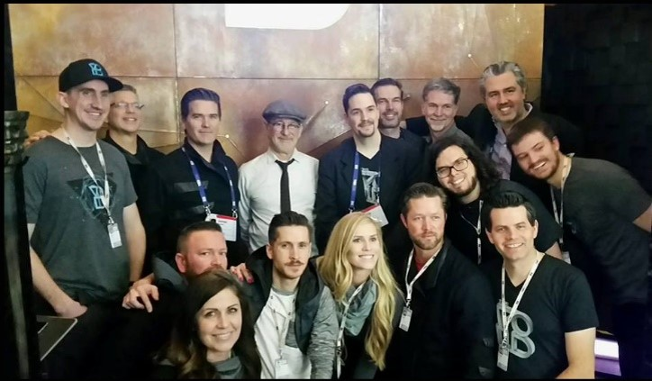
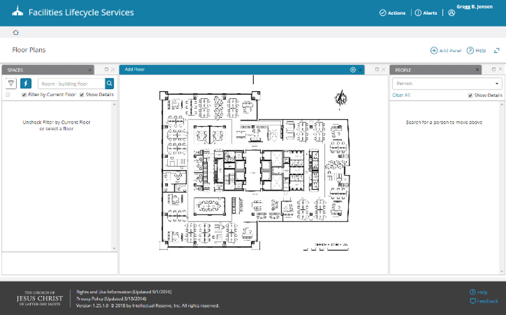
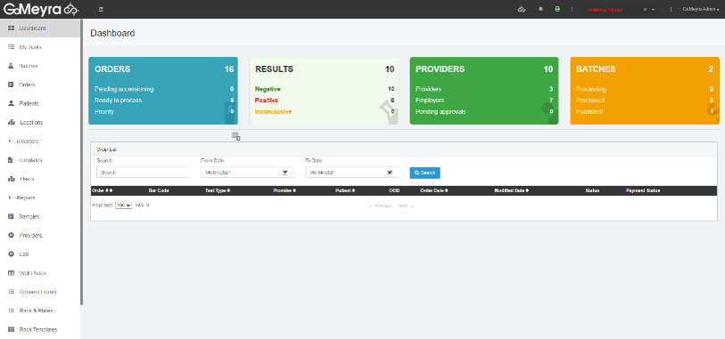

Gregg B. Jensen
=======================================================================================================================================

Software Engineering Management Executive
-----------------------------------------

Proven expertise in spearheading the architecture and delivery of robust software from inception through successful coding, database design, and deployment. Demonstrated track record in building, inspiring, and mentoring diverse teams to maximize overall performance. Known for devising effective cloud-native strategies, efficient CI/CD processes, and infrastructure management across multiple platforms, underlining a strong commitment to innovation and operational excellence. History of defining the overall vision and strategic direction for projects and architecture, focusing on time and budget-compliant delivery. Skilled at keeping abreast with the latest technology trends and best practices to enable feature development, integrations, and legacy modernization.

* 🌍  I'm based in Utah
* 🖥️  See my portfolio at [LinkedIn](http://www.linkedin.com/in/greggbjensen/)
* 🚀  I'm currently working on [PrDeploy](http://github.com/greggbjensen/prdeploy)
* 🤝  I'm open to collaborating on Kubernetes across AWS, Google, and Azure clouds

### Skills

### Portfolio

<table><tr><td>

#### THE VOID
Mixed Reality / Spatial VR

 
 

</td>
<td>

#### Church of Jesus Christ
Recreational Properties

 

Space Management

 

</td>
<td>

#### Ancestry.com
Mundia

 

Ancestry Publisher

 

</td>
<td>

#### Veracity Solutions
AllScripts Prenatal

 

#### Gomyera
Lab Management

 

#### OneGreatFamily.com
Family History

 

</td></tr></table>

### Socials

 <a href="https://www.github.com/greggbjensen" target="_blank" rel="noreferrer"> <picture> <source media="(prefers-color-scheme: dark)" srcset="https://raw.githubusercontent.com/danielcranney/readme-generator/main/public/icons/socials/github-dark.svg" /> <source media="(prefers-color-scheme: light)" srcset="https://raw.githubusercontent.com/danielcranney/readme-generator/main/public/icons/socials/github.svg" />  </picture> </a> <a href="https://www.linkedin.com/in/greggbjensen" target="_blank" rel="noreferrer"> <picture> <source media="(prefers-color-scheme: dark)" srcset="https://raw.githubusercontent.com/danielcranney/readme-generator/main/public/icons/socials/linkedin-dark.svg" /> <source media="(prefers-color-scheme: light)" srcset="https://raw.githubusercontent.com/danielcranney/readme-generator/main/public/icons/socials/linkedin.svg" />  </picture> </a>

### Badges

<b>My GitHub Stats</b>

<b>Top Repositories</b>

       

   

